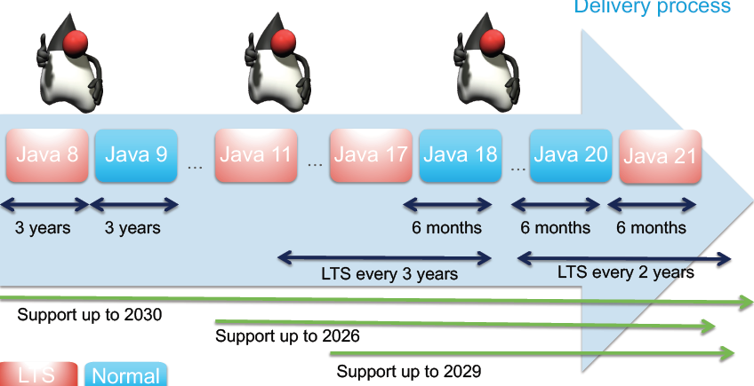

# JDK9_21
Get to know JDK 9 - 21 features along with sample code

# Java Delivery Process

## Terms
JCP: Java Community Process - responsible for Java governance
JLS: Java Language Specification
JSR: Java Specification Request - big piece of Java change submitted to JCP
JEP: Java Enhancement Proposal - small pieces of Java change

See JEPs in JDK projects:
https://openjdk.org/jeps/0

# JDK 10
- var: reserved identifier

# JDK 11
https://openjdk.org/projects/jdk/11/

# JDK 17
https://openjdk.org/projects/jdk/17/

# JDK 21
https://openjdk.org/projects/jdk/21/